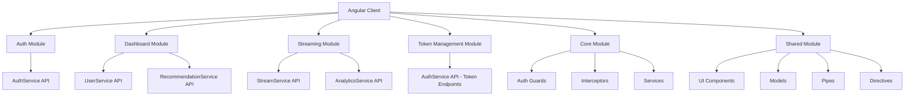
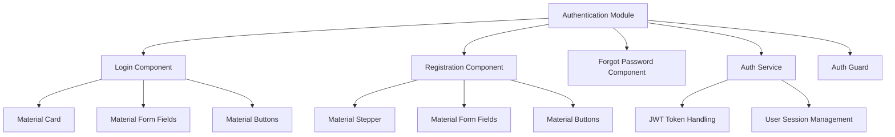
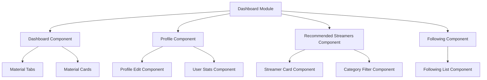
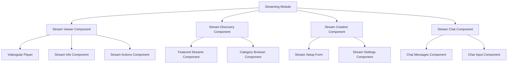
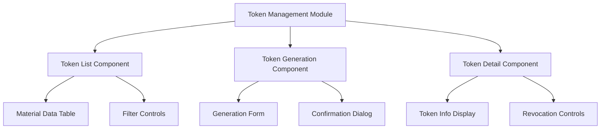

# Angular Streaming Platform Implementation Plan

## Project Overview

The Angular client will interface with multiple backend microservices:
- AuthService: Handles user registration, login, and token management
- UserService: Manages user profiles and relationships
- StreamService: Handles stream creation, management, and retrieval
- AnalyticsService: Tracks and provides analytics for streams and users
- RecommendationService: Provides personalized stream and user recommendations

## Architecture

## Module Structure

### Core Module
- Authentication service
- HTTP interceptors for JWT tokens
- Guards for protected routes
- Global error handling
- State management services

### Shared Module
- Reusable UI components
- Models/interfaces
- Pipes
- Directives
- Utility services

### Feature Modules
1. Authentication Module
2. Dashboard Module
3. Streaming Module
4. Token Management Module

## Implementation Details

### 1. Project Setup and Configuration

1. **Angular Material Integration**
   - Already installed in package.json
   - Configure theme customization in theme.scss
   - Set up Tailwind integration with Angular Material

2. **Routing Configuration**
   - Set up lazy-loaded feature modules
   - Configure route guards for protected routes
   - Implement route animations

3. **HTTP Interceptor Setup**
   - JWT token interceptor for authentication
   - Error handling interceptor
   - Loading state interceptor

### 2. Authentication Module

#### Components:
1. **Login Component**
   - Material UI Card with Tailwind styling
   - Form with username/email and password fields
   - Remember me checkbox
   - Login button with loading state
   - Link to registration page

2. **Registration Component**
   - Multi-step registration using Material Stepper
   - Step 1: Basic information (username, email, password)
   - Step 2: Profile information (optional)
   - Form validation with Material error states
   - Submit button with loading state

3. **Auth Service**
   - Methods for login, register, logout
   - JWT token storage and management
   - User session handling

### 3. Dashboard Module

#### Components:
1. **Dashboard Component**
   - Material tabs for navigation between sections
   - Header with user information and notifications
   - Main content area with router outlet for child routes

2. **Profile Component**
   - User profile information display
   - Edit profile functionality
   - Streaming statistics
   - Material expansion panels for settings

3. **Recommended Streamers Component**
   - Grid of streamer cards using Material grid list
   - Filtering by category using Material chips
   - Infinite scroll for loading more recommendations

4. **Following Component**
   - List of followed streamers
   - Quick access to active streams
   - Unfollow functionality

### 4. Streaming Module

#### Components:
1. **Stream Viewer Component**
   - Videogular integration for video playback
   - Stream information display
   - Viewer count and engagement metrics
   - Action buttons (like, share, follow)
   - Chat integration

2. **Stream Discovery Component**
   - Featured streams carousel
   - Category-based browsing
   - Search functionality
   - Filtering options

3. **Stream Creation Component**
   - Stream setup form
   - Category selection
   - Tags input
   - Stream settings configuration

4. **Stream Chat Component**
   - Real-time chat messages display
   - Message input with emoji support
   - User presence indicators
   - Moderation tools

### 5. Token Management Module

#### Components:
1. **Token List Component**
   - Material data table for token listing
   - Filtering and sorting options
   - Actions for token management

2. **Token Generation Component**
   - Form for generating new tokens
   - Purpose selection
   - Expiration settings
   - Confirmation dialog

3. **Token Detail Component**
   - Token information display
   - Usage statistics
   - Revocation controls

### 6. Shared UI Components

1. **Layout Components**
   - App shell with responsive sidebar
   - Header with user menu
   - Footer with links

2. **UI Components**
   - Custom buttons combining Material and Tailwind
   - Cards with consistent styling
   - Form controls with validation
   - Loading indicators
   - Notification components

3. **Directives**
   - Infinite scroll directive
   - Click outside directive
   - Lazy loading image directive

## Implementation Approach

### Phase 1: Core Setup
1. Configure Angular Material and Tailwind CSS integration
2. Set up core module with authentication services
3. Implement HTTP interceptors for JWT handling
4. Create shared UI components

### Phase 2: Authentication Module
1. Implement login component
2. Create registration flow
3. Set up auth guards and services
4. Integrate with AuthService API

### Phase 3: Dashboard Module
1. Create dashboard layout
2. Implement profile component
3. Build recommended streamers component
4. Develop following management features
5. Integrate with UserService and RecommendationService APIs

### Phase 4: Streaming Module
1. Implement stream viewer with Videogular
2. Create stream discovery components
3. Build stream creation functionality
4. Develop chat features
5. Integrate with StreamService API

### Phase 5: Token Management Module
1. Create token listing component
2. Implement token generation
3. Build token detail view
4. Integrate with AuthService token endpoints

### Phase 6: Testing and Optimization
1. Unit testing with Jasmine/Karma
2. End-to-end testing with Cypress
3. Performance optimization
4. Accessibility improvements

## Technical Considerations

### State Management
- Use Angular services with RxJS for state management
- Consider NgRx for more complex state requirements

### API Integration
- Create service classes for each backend service
- Use RxJS operators for handling API responses
- Implement proper error handling and retry logic

### Responsive Design
- Use Tailwind's responsive utilities
- Ensure all components work on mobile, tablet, and desktop
- Implement responsive layouts with CSS Grid and Flexbox

### Performance
- Lazy load feature modules
- Implement virtual scrolling for long lists
- Use OnPush change detection where appropriate
- Optimize bundle size with proper tree-shaking

### Security
- Implement proper JWT token handling
- Secure routes with guards
- Sanitize user inputs
- Protect against common web vulnerabilities
